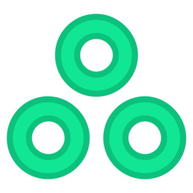

<div align="center">



# larvae

**One toolchain for all of Luau.**

One parallel Rust binary. It has transformers today, and formatting and linting come next.

[](https://github.com/larvae-luau/larvae/actions/workflows/ci.yml)
[](https://github.com/larvae-luau/larvae/releases/latest)
[](https://github.com/larvae-luau/larvae/releases)
[](LICENSE.md)

</div>

larvae starts with require rewriting that no other tool in the ecosystem
does. It refuses to emit a require that would fail at runtime. Roblox
shipped native string requires, and `@game/...` became available in early
2026. No tool generated them. larvae does.

```lua
-- what you write
local Signal = require("@pkg/signal")

-- what ships
local Signal = require("@game/ReplicatedStorage/Packages/signal")
```

```toml
# larvae.toml
[aliases]
pkg = "@game/ReplicatedStorage/Packages"
```

That is the whole idea. There are no Instance chains and no sourcemap, and
the output stays readable in a diff.

## Why not darklua

darklua is good software. larvae accepts every darklua rule name, so a user
can port a config with almost no changes. Five things are different.

**It emits native string requires.** darklua only produces Instance chains
such as `script.Parent:FindFirstChild("Foo")`. larvae can also produce
them, with all three indexing styles, but it does not have to.

**It refuses to emit requires that fail at runtime.** Code under
StarterPlayerScripts runs as a clone. An absolute `@game/StarterPlayer/...`
require therefore resolves to the template, not the copy, and module state
silently duplicates. Client code cannot reach ServerScriptService at all.
larvae maps both ends of every require into the DataModel and reports an
error in both cases. No other tool in the ecosystem checks this, and that
includes darklua and luau lsp.

**It is faster by architecture, not by tuning.** larvae processes files in
parallel. A rewrite is a byte range splice, not a full reprint. There is
also an incremental cache. darklua is single threaded, and has been since
the issue was filed in 2021.

| files | larvae cold | larvae warm | darklua | speedup |
|---:|---:|---:|---:|---:|
| 3000 | 27 ms | 14 ms | 424 ms | 15.7x |
| 5000 | 44 ms | 24 ms | 722 ms | 16.4x |
| one 3.5 MB file | 21 ms | 3 ms | 1375 ms | 65.4x |

darklua ran with an empty rule list, so it only parsed and reprinted, while
larvae did the full job. Run `scripts/bench.sh` to reproduce the numbers.

**One Rojo project file.** The usual setup keeps two almost identical
project files: one points at the source for sourcemaps, and one points at
the build output for serving. larvae derives the second file from the first
and keeps it current, so the user edits one file.

**It never runs rojo.** Serving is rojo's job. larvae writes
`.larvae/build.project.json` and does nothing more.

## Install

```bash
cargo install --path .
larvae self install
```

`self install` copies the binary to `~/.larvae/bin` and prints the line to
add to the shell profile. Run `larvae self update` later to get the latest
release.

## Getting started

```bash
cd my-rojo-project
larvae init      # writes larvae.toml, offers to update .gitignore
larvae process   # writes dist/ and .larvae/build.project.json
rojo serve .larvae/build.project.json
```

A project that already has a `default.project.json` and `.luaurc` aliases
needs no config. Mounts come from the project file, and aliases come from
`.luaurc`. `larvae process` then works without setup.

During editing, `larvae process --watch` rebuilds on each save and mirrors
deletions. When a file does not lex, the command keeps the last good
output. A partial save therefore does not spread require failures into a
live Studio session.

## Commands

| command | what it does |
|---|---|
| `larvae process` | rewrite requires into the output directory |
| `larvae process --watch` | the same, on every save |
| `larvae check` | validate requires and syntax, write nothing, exit non zero on errors |
| `larvae init` | scaffold a config |
| `larvae self code` | set up editor completion for larvae.toml |
| `larvae self install` | manage the install, with `update` and `uninstall` |

`check` is the CI gate. It reports requires that do not resolve, realm
violations, alias cycles, and syntax errors. It also counts the dynamic
requires that it intentionally did not change.

## Configuration

Every key is optional. Run `larvae self code` to get completion and hover
docs. The command sets up Even Better TOML when that extension is
installed. When the extension is absent, the command writes a schema line
in the config instead.

```toml
[aliases]
pkg = "@game/ReplicatedStorage/Packages"

[process]
input = "src"
output = "dist"
quotes = "preserve"        # or double, or single

[requires]
target = "roblox-string"   # or path for Lune, or roblox-instance
strict = false

[rules]
const_requires = true      # local X = require(...) becomes const X = require(...)
add_luau_directive = "strict"
```

An unknown key is a hard error. A key for a feature that does not exist yet
reports the release that adds the feature. larvae ignores nothing silently.

## Status

Requires, the Rojo integration, the parser, the cache, and watch mode all
work today. The next work items are: Instance requires as input, so that
existing codebases can convert; compile time constants; build profiles; and
the rest of the rules, now possible because the parser exists. After that:
bundling with a documented module init order, cross module dead code
elimination, and transforms that the user writes in Luau.

## License

MIT, see [LICENSE.md](LICENSE.md).
